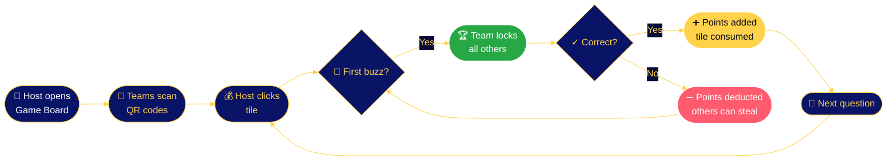
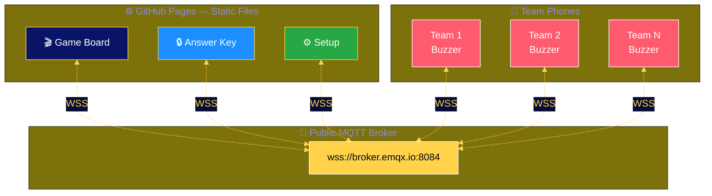

<div align="center">

<!-- ============ ANIMATED HERO ============ -->

<a href="https://kiskander.github.io/ciscolive-jeopardy/game.html">
  
</a>

<br />

<!-- ============ STATUS BADGES ============ -->


<br />

<!-- ============ HERO TAGLINE ============ -->

### 🎮 A real-time, browser-based quiz game with live team buzzers
#### Powered by MQTT over WebSockets · Designed for the stage · Deploys in 60 seconds

<br />

<!-- ============ QUICK LAUNCH BAR ============ -->

<table>
<tr>
<td align="center" width="200">
  <a href="https://kiskander.github.io/ciscolive-jeopardy/game.html">
    <br />
    <sub><b>For the projector</b></sub>
  </a>
</td>
<td align="center" width="200">
  <a href="https://kiskander.github.io/ciscolive-jeopardy/buzzer.html?team=ansible">
    <br />
    <sub><b>For team phones</b></sub>
  </a>
</td>
<td align="center" width="200">
  <a href="https://kiskander.github.io/ciscolive-jeopardy/answer-key.html">
    <br />
    <sub><b>For the host (private)</b></sub>
  </a>
</td>
<td align="center" width="200">
  <a href="https://kiskander.github.io/ciscolive-jeopardy/setup.html">
    <br />
    <sub><b>Configure live</b></sub>
  </a>
</td>
</tr>
</table>

<br />


</div>

## ✨ What makes this special

<table>
<tr>
<td width="50%" valign="top">

### 🚀 Zero infrastructure
- **No server.** No database. No deploy pipeline.
- **GitHub Pages** hosts everything as static files.
- **MQTT over WebSocket** carries every buzz, every score, every config change in real time.
- Works **on enterprise Wi-Fi** — uses port 443 only.

</td>
<td width="50%" valign="top">

### 🎨 Showtime aesthetic
- Drifting **starfield** + animated light beams
- **Gold accents** with pulsing underline
- 3D **buzzer dome** with ready-state pulse
- Synchronized score animations + **floating tickers**
- **Tweaks panel** for live customization

</td>
</tr>
<tr>
<td width="50%" valign="top">

### ⚡ Real-time, instant
- First buzz locks all others — **sub-100ms** latency
- Wrong answer? Other teams can steal.
- Setup page **publishes config live** to every screen
- Multiple deployments **auto-isolate** by hostname

</td>
<td width="50%" valign="top">

### 🛠️ Built for events
- **QR codes** for buzzer URLs
- **Final Jeopardy** round (toggleable)
- **3 question sessions** baked in, easy to add more
- **Pre-session test page** to verify every buzzer

</td>
</tr>
</table>

<div align="center">


## 🎬 Game Flow

</div>



<div align="center">


## 🏗️ Architecture

</div>



| Topic | Direction | Purpose |
|---|---|---|
| `jeopardy/<id>/buzz` | Phones → Board | Team buzzer presses |
| `jeopardy/<id>/control` | Board → Phones | Reset / disable commands |
| `jeopardy/<id>/question` | Board → Answer Key | Sync current question |
| `jeopardy/<id>/config` | Setup → All (retained) | Live configuration |

> 💡 **Hostname-namespaced** — `<id>` is auto-derived from `window.location.host`. Run multiple deployments side-by-side with zero config.

<div align="center">


## 🚀 Deploy in 60 seconds

</div>

<details>
<summary><b>👉 Step-by-step (click to expand)</b></summary>

```bash
# 1. Fork or clone
git clone https://github.com/kiskander/ciscolive-jeopardy.git
cd ciscolive-jeopardy

# 2. (optional) test locally
python3 -m http.server 8000
# → open http://localhost:8000/game.html

# 3. Push to your fork
git push origin main

# 4. Enable GitHub Pages
#    Settings → Pages → Source: main branch → Save

# 5. Wait ~30s, then visit:
#    https://<you>.github.io/<repo>/setup.html

# 6. Configure teams + branding → click "Save & Publish Live"
# 7. Share buzzer URLs (or QR codes) with players → 🎮 Showtime
```

</details>

<div align="center">


## 📂 What's in the box

</div>

```
🎬  game.html                Main game board (projector)
🔴  buzzer.html              Team buzzer (phone)
🔒  answer-key.html          Host answer display (password protected)
⚙️  setup.html               Live configuration UI
🧪  test-buzzers.html        Pre-session testing
🎨  showtime-shared.css      Shared Showtime theme
✨  showtime-stars.js        Starfield animation engine
🗂️  config.json              Default configuration
📚  data/
    ├── session_1.json       Question set 1
    ├── session_2.json       Question set 2
    └── session_3.json       Question set 3
🖼️  images/
    ├── learn-with-cisco.png Default logo
    └── teams/               Optional team logos
```

<div align="center">


## 📝 Add your own questions

</div>

Drop a new file under `data/` (e.g. `data/session_4.json`):

```json
{
  "finalJeopardy": {
    "q": "Your final question",
    "a": "What is the answer?"
  },
  "categories": [
    {
      "name": "Network Fabric",
      "questions": [
        { "q": "This protocol replaced STP for active-active...", "a": "What is TRILL?" },
        { "q": "...", "a": "..." }
      ]
    }
  ]
}
```

Load it via URL param:

```
game.html?board=session_4
```

<div align="center">


## ✅ Pre-show checklist

</div>

| | Check |
|---|---|
| 🟢 | Setup page connects to MQTT (green pill in header) |
| 👥 | Teams appear on game board after publishing config |
| 📱 | Buzzer pages show correct team info |
| 🔒 | First buzz locks all other buzzers |
| 💸 | Wrong answer allows other teams to steal |
| ✨ | Correct answer disables tile and reveals answer |
| 🎯 | Closing without answering keeps tile active |
| 🔑 | Answer key syncs question and shows buzzing team |
| 🏆 | Final Jeopardy button respects toggle setting |
| 🎨 | Logo, eyebrow, and title update live from setup |

<div align="center">


## 💡 Why it works on enterprise Wi-Fi

</div>

```
✓  WebSocket Secure (WSS) — port 443, indistinguishable from HTTPS
✓  No VPN, no firewall exceptions, no IT tickets
✓  Public MQTT broker handles every real-time message
✓  Pure client-side — nothing to host, nothing to maintain
```

<div align="center">

<br />


<sub>Built for live events · Powered by ⚡ MQTT + 🪄 GitHub Pages</sub>

<br />

<a href="https://kiskander.github.io/ciscolive-jeopardy/game.html">
  
</a>

<br /><br />

<sub>⭐ If this helped you run a great session, star the repo</sub>

</div>
