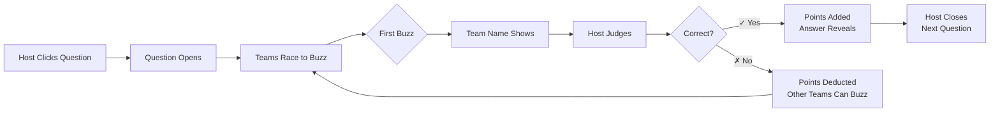

<div align="center">

```diff
╔═══════════════════════════════════════════════════════════════════════════════╗
║                                                                               ║
+   ██╗    ██╗███████╗██╗      ██████╗ ██████╗ ███╗   ███╗███████╗            
+   ██║    ██║██╔════╝██║     ██╔════╝██╔═══██╗████╗ ████║██╔════╝            
+   ██║ █╗ ██║█████╗  ██║     ██║     ██║   ██║██╔████╔██║█████╗              
+   ██║███╗██║██╔══╝  ██║     ██║     ██║   ██║██║╚██╔╝██║██╔══╝              
+   ╚███╔███╔╝███████╗███████╗╚██████╗╚██████╔╝██║ ╚═╝ ██║███████╗            
+    ╚══╝╚══╝ ╚══════╝╚══════╝ ╚═════╝ ╚═════╝ ╚═╝     ╚═╝╚══════╝            
║                                                                               ║
@                         ████████╗ ██████╗                                    
@                         ╚══██╔══╝██╔═══██╗                                   
@                            ██║   ██║   ██║                                   
@                            ██║   ██║   ██║                                   
@                            ██║   ╚██████╔╝                                   
@                            ╚═╝    ╚═════╝                                    
║                                                                               ║
!        ██████╗██╗███████╗ ██████╗ ██████╗     ██╗     ██╗██╗   ██╗███████╗  
!       ██╔════╝██║██╔════╝██╔════╝██╔═══██╗    ██║     ██║██║   ██║██╔════╝  
!       ██║     ██║███████╗██║     ██║   ██║    ██║     ██║██║   ██║█████╗    
!       ██║     ██║╚════██║██║     ██║   ██║    ██║     ██║╚██╗ ██╔╝██╔══╝    
!       ╚██████╗██║███████║╚██████╗╚██████╔╝    ███████╗██║ ╚████╔╝ ███████╗  
!        ╚═════╝╚═╝╚══════╝ ╚═════╝ ╚═════╝     ╚══════╝╚═╝  ╚═══╝  ╚══════╝  
║                                                                               ║
-                 ██╗███████╗ ██████╗ ██████╗  █████╗ ██████╗ ██████╗ ██╗   ██╗
-                 ██║██╔════╝██╔═══██╗██╔══██╗██╔══██╗██╔══██╗██╔══██╗╚██╗ ██╔╝
-                 ██║█████╗  ██║   ██║██████╔╝███████║██████╔╝██║  ██║ ╚████╔╝ 
-            ██   ██║██╔══╝  ██║   ██║██╔═══╝ ██╔══██║██╔══██╗██║  ██║  ╚██╔╝  
-            ╚█████╔╝███████╗╚██████╔╝██║     ██║  ██║██║  ██║██████╔╝   ██║   
-             ╚════╝ ╚══════╝ ╚═════╝ ╚═╝     ╚═╝  ╚═╝╚═╝  ╚═╝╚═════╝    ╚═╝   
║                                                                               ║
#                    CCNP Automation Core (AUTOCOR) Edition                    
#                         Session: IBOCRT-2775                                 
║                                                                               ║
╚═══════════════════════════════════════════════════════════════════════════════╝
```

</div>

<div align="center">

### 🎮 Interactive Jeopardy Game with Real-Time Team Buzzers

[](https://www.ciscolive.com)
[](https://www.cisco.com/c/en/us/training-events/training-certifications/certifications/professional/ccnp-enterprise.html)
[](https://kiskander.github.io/autocor-jeopardy/)

</div>

---

## 🚀 Quick Start

### 🎯 Play the Game

| Link | Description |
|------|-------------|
| [**Main Game Board**](https://kiskander.github.io/autocor-jeopardy/autocor_jeopardy.html) | Display on projector for audience |
| [**Answer Key**](https://kiskander.github.io/autocor-jeopardy/answer-key.html) | Private display for host (password protected) |
| [**Test Page**](https://kiskander.github.io/autocor-jeopardy/test-buzzers.html) | Pre-session testing & debugging |

### 📱 Team Buzzer URLs (Convert to QR Codes)

```
🔴 Team Ansible:   https://kiskander.github.io/autocor-jeopardy/buzzer.html?team=ansible
🟣 Team Terraform: https://kiskander.github.io/autocor-jeopardy/buzzer.html?team=terraform
🔵 Team Python:    https://kiskander.github.io/autocor-jeopardy/buzzer.html?team=python
🟢 Team YANG:      https://kiskander.github.io/autocor-jeopardy/buzzer.html?team=yang
🟠 Team pyATS:     https://kiskander.github.io/autocor-jeopardy/buzzer.html?team=pyats
```

---

## ✨ Features

<table>
<tr>
<td width="50%">

### 🎮 Real-Time Buzzers
- Team members buzz from phones
- First buzz locks all others
- Wrong answers enable steals
- MQTT over WebSockets (port 443)

### 🎯 Smart Scoring
- Quick ✓/✗ buttons for judging
- Judge before revealing answer
- Auto-reset between questions
- Manual override controls

</td>
<td width="50%">

### 🔒 Private Answer Key
- Password protected display
- Real-time question sync
- Large, easy-to-read answers
- Shows buzzing team

### 🎨 Professional Design
- Cisco Live 2025 branding
- Custom team icons
- Buzz sound effects
- Mobile-friendly interface

</td>
</tr>
</table>

---

## 🎯 Game Flow



---

## 🛠️ Technical Architecture

### Stack
- **Frontend**: Pure HTML/CSS/JavaScript
- **Communication**: MQTT over WebSockets (WSS)
- **Hosting**: GitHub Pages (static)
- **Broker**: `wss://test.mosquitto.org:8081` (public)

### MQTT Topics
```
jeopardy/buzz     → Team buzzer presses
jeopardy/control  → Reset/disable commands
jeopardy/question → Question/answer sync to answer key
```

### Why It Works Everywhere
- ✅ No backend server required
- ✅ Uses port 443 (HTTPS standard)
- ✅ Works on enterprise WiFi
- ✅ Pure client-side architecture
- ✅ Public MQTT broker handles all real-time communication

---

## 📋 Session Information

**Session**: IBOCRT-2775 - Level Up Your CCNP Automation Skills – Jeopardy Style  
**Type**: Interactive Breakout Session  
**Level**: Intermediate  
**Topics**: DevOps, Automation & Orchestration, Programmability

### Categories
- 🌐 Network Automation
- 🏗️ Infrastructure as Code
- ⚙️ Operations
- 🤖 AI in Automation

---

## 🧪 Testing Checklist

- [ ] Main board loads with Cisco Live branding
- [ ] Answer key accepts password (`REDACTED`)
- [ ] Test page shows all 5 team buzzers
- [ ] Buzz sound plays when testing
- [ ] Buzzer indicator shows on main board
- [ ] Answer syncs to answer key page
- [ ] Wrong answer locks out team
- [ ] Other teams can buzz after wrong answer
- [ ] Correct answer reveals and allows closing
- [ ] Manual override buttons work

---

## 🎓 Teams

| Team | Icon | Color | Technology |
|------|------|-------|------------|
| **Ansible** | 🔴 A | Red | Configuration Management |
| **Terraform** | 🟣 T | Purple | Infrastructure as Code |
| **Python** | 🔵 P | Blue/Yellow | Programming Language |
| **YANG** | 🟢 🌳 | Green | Data Modeling |
| **pyATS** | 🟠 🧪 | Orange | Testing Framework |

---

## 📚 Documentation

- [**CHANGELOG.md**](CHANGELOG.md) - Detailed feature list and changes
- [**GitHub Repo**](https://github.com/kiskander/autocor-jeopardy) - Source code
- **Branch**: `alex-trebek-rip` - Active development branch

---

## 🤝 Contributing

This project is for Cisco Live session IBOCRT-2775. For questions or issues:
- Open an issue on GitHub
- Contact the session facilitator

---

## 📄 License

Created for Cisco Live 2025 - CCNP AUTOCOR Certification Prep

---

<div align="center">

### 🎉 Ready to Play?

**[Launch Game Board →](https://kiskander.github.io/autocor-jeopardy/autocor_jeopardy.html)**

---

Made with ❤️ for Cisco Live 2025 | Session IBOCRT-2775

</div>
